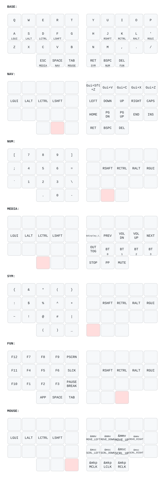

# Corne ZMK Keymap

Split ergonomic keyboard (42 keys) running [ZMK firmware](https://zmk.dev) on Nice!Nano v2.
Miryoku-style layout adapted from TOTEM config.

## Keymap

Auto-generated from [`config/corne.keymap`](config/corne.keymap) via [keymap-drawer](https://github.com/caksoylar/keymap-drawer):



The SVG updates automatically on push via the [Draw Keymap](.github/workflows/draw-keymap.yml) workflow.

## Display

- **Left (central):** Built-in ZMK status screen (layer, battery, BT)
- **Right (peripheral):** Custom Trishul logo + battery + BT status

## Interactive Viewer

```sh
make viewer
```

Press `?` for the cheat sheet. Press `0-6` to switch layers.

## Build Firmware

Firmware builds locally via [`just`](https://github.com/casey/just) + Docker — no cloud CI needed.
Requires `just` and Docker Desktop (running).

```sh
just build             # build all targets -> firmware/
just build left right  # build only specific halves (faster)
just clean             # wipe the local west workspace + build cache
```

Targets: `left` `right` `left_view` `right_view` `reset`. Outputs land in `firmware/` (committed to
git) as `corne_left.uf2`, `corne_right.uf2`, `corne_left_nice_view.uf2`, `corne_right_nice_view.uf2`,
`settings_reset.uf2`.

### Flash

1. Double-tap the reset button on a half → it mounts as the `NICENANO` USB drive.
2. Drag the matching `.uf2` from `firmware/` onto it; it reboots automatically.
3. Repeat for the other half. Reflash **both** halves after any `config/` change.

## Regenerate Keymap SVG

```sh
make install   # one-time: pip install keymap-drawer
make svg       # parse + render SVG
```

## Hardware

- **Board:** Nice!Nano v2 (nRF52840)
- **Shield:** Corne (split, 6x3+3)
- **Display:** OLED SSD1306 128x32 / Nice!View
- **RGB:** Disabled (no LEDs installed)
- **Bluetooth:** 4 profiles
- **ZMK Studio:** Enabled
- **Mouse/Pointing:** Enabled
