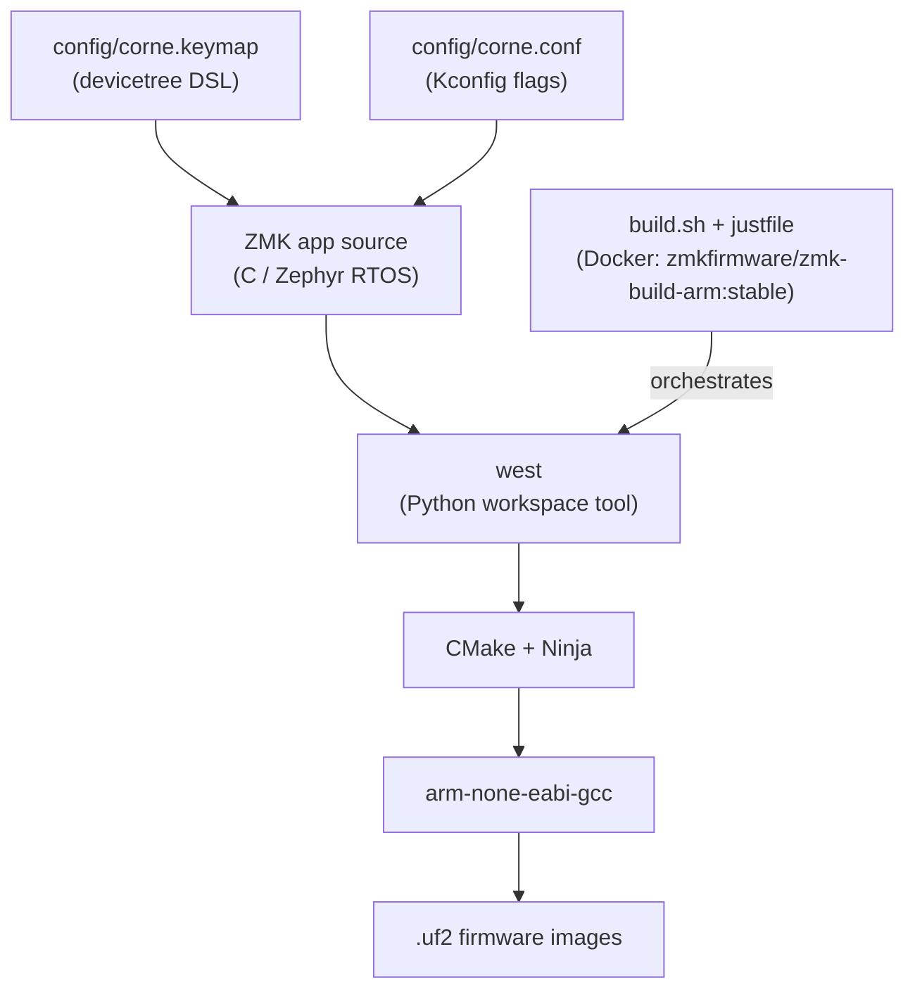

# Keyboard Firmware: ZMK vs QMK vs RMK

This repo runs ZMK on a Corne split (nice!nano v2 / nRF52840); this doc explains the three major open-source keyboard firmwares and why ZMK is the right fit here.

---

## TL;DR

| | QMK | ZMK | RMK |
|---|---|---|---|
| **Language** | C | C (on Zephyr RTOS) | Rust + Embassy async |
| **Build / config** | `qmk` CLI + Makefiles; `keymap.c` + `rules.mk` | `west` + CMake + Kconfig + devicetree (`.keymap` / `.conf`) | Cargo + `keyboard.toml` |
| **Wireless (BLE)** | Niche forks only (BlueMicro / nRF branches); not mainline | First-class — designed for it | First-class (TrouBLE + Nordic SDC, v0.7+) |
| **Wired USB** | First-class | Supported | Supported (~2 ms latency) |
| **Split keyboards** | Serial / I2C wired (TRRS) | BLE or wired UART | BLE multi-peripheral or wired |
| **Live keymap editing** | VIA / Vial | ZMK Studio | Native Vial (incl. over BLE) |
| **Maturity / ecosystem** | Largest, oldest | Large, fast-growing, wireless-focused | Youngest, smallest, active |
| **Best fit** | Wired boards | Wireless / split / low-power boards | Rust users / green-field wireless builds |

---

## QMK

- C, bare-metal (no RTOS), targets AVR and ARM MCUs.
- Config = `keymap.c` key arrays + `rules.mk` feature flags; large board and feature library.
- Massive community — most off-the-shelf boards ship QMK-ready.
- Live keymap editing via VIA or Vial without reflashing.
- Wireless is not a mainline strength: BLE lives in forks (BlueMicro, nRF-specific branches) and is not first-party supported.
- **Tradeoff:** unmatched wired ecosystem; wireless is bolted-on, not native.

## ZMK

- C on the Zephyr RTOS; inherits Zephyr's power-management, BLE stack (Nordic SoftDevice Controller), and devicetree hardware model.
- Config via devicetree `.keymap` (bindings, layers, combos, hold-tap, home-row mods) + `.conf` Kconfig flags — no C to write for normal keymap work.
- Designed for BLE and low power from the ground up; peripherals talk only to the central, never directly to the host.
- ZMK Studio gives live keymap editing over USB UART without reflashing (central half only).
- Split adds ~3.75 ms avg / ~7.5 ms worst-case BLE latency. ([ZMK split docs](https://zmk.dev/docs/features/split-keyboards))
- **Tradeoff:** steeper setup (Zephyr / devicetree / Kconfig toolchain) but best-in-class wireless and power management.

## RMK

- Rust + Embassy async executor; `no_std`, compile-time memory safety, no garbage collector.
- Config via a single `keyboard.toml` (Rust API also available for power users who want full control).
- v0.7+ uses the TrouBLE BLE host + Nordic SoftDevice Controller for wireless.
- Runs on nice!nano / nRF52840 with the Adafruit nRF52 bootloader; flashes via `.uf2` drag-and-drop, no debug probe needed.
- Reported ~2 ms wired / ~10 ms BLE latency; ~2–3 months on a 2000 mAh battery with `async_matrix`.
- Native Vial (including over BLE); supports multi-split (one central, unlimited peripherals).
- **Tradeoff:** newest and smallest ecosystem — fewer eyes on it, fewer ready-made shield definitions — but type-safe and architecturally modern. ([RMK repo](https://github.com/HaoboGu/rmk), [RMK split docs](https://rmk.rs/main/docs/features/split_keyboard), [v0.6→v0.7 migration](https://rmk.rs/main/docs/migration/v06_v07))

---

## Where this repo sits

**Hardware**

- Board: nice!nano v2 (nRF52840)
- Shield: Corne split 6×3+3
- Display: OLED SSD1306 128×32 / nice!view (SPI via nice_view_adapter)
- 4 BLE profiles; ZMK Studio enabled; mouse/pointing enabled

**Build pipeline**

`config/corne.keymap` + `corne.conf` feed the ZMK app (C/Zephyr); `west` (Python) drives CMake + Ninja, which calls `arm-none-eabi-gcc`, producing `.uf2` images. Locally, `build.sh` + `justfile` orchestrate everything inside the `zmkfirmware/zmk-build-arm:stable` Docker image; GitHub Actions runs the same steps via the matrix in `build.yaml`.

The left half is built with the `studio-rpc-usb-uart` snippet (central side, USB-connected to host); the right half runs as a BLE peripheral and needs no Studio transport.

---

## Could this run Rust (RMK) instead?

**Yes** — RMK runs on this exact hardware (nice!nano / nRF52840, `.uf2`).

Migrating means rewriting everything in `config/` into `keyboard.toml` + Cargo/Embassy: all layers, combos, home-row-mod timing, nice!view/OLED shield definitions, and the `build.yaml` CI matrix. ZMK Studio live-editing (wired to the central half via `studio-rpc-usb-uart`) has no equivalent in RMK's current Vial-over-BLE path.

Rust's main win — compile-time memory safety in firmware code *you write* — barely applies here. This repo maintains a keymap DSL, not firmware; the C is upstream, battle-tested ZMK. The safety argument lands when you're authoring Embassy tasks and interrupt handlers yourself.

Rewriting `build.sh` / `justfile` glue in Rust would be strictly worse: bash correctly wraps Docker + west; Rust buys nothing there.

**Verdict:** keep ZMK for this repo. Consider RMK only for a green-field build where you are authoring firmware behavior and want Rust's guarantees in the code you actually write.

---

## References

- [ZMK home](https://zmk.dev)
- [ZMK split keyboard docs](https://zmk.dev/docs/features/split-keyboards)
- [QMK docs](https://docs.qmk.fm)
- [RMK repository](https://github.com/HaoboGu/rmk)
- [RMK documentation](https://rmk.rs)
- [RMK v0.6 → v0.7 migration](https://rmk.rs/main/docs/migration/v06_v07)
